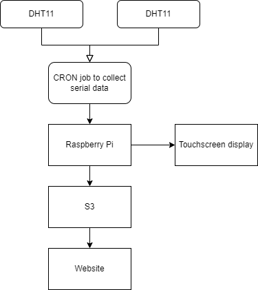

**Introduction:**

Artemis Lab—the burgeoning home laboratory of Mycologeek—is currently in its foundational stage of development. Our immediate focus is on constructing a sensor network to monitor temperature and humidity, which are critical factors in mushroom cultivation. By tracking these environmental conditions, we aim to make necessary adjustments and set up effective controls for our mushroom growing operations. This initiative is the first in a series of sensor deployments; we are beginning with two sensors to establish the network's core functionality. Our ultimate goal is to enable remote monitoring of these parameters through our website, providing real-time data to optimize the cultivation process.

**Project Overview:**

The project centers around continuously capturing temperature and humidity data using DHT11 sensors connected to Arduino Nanos on a breadboard. These sensors are powered via USB and connected to a Raspberry Pi 4, which acts as a bridge for collecting serial data. The Raspberry Pi runs a cron job that gathers the sensor data at regular intervals and sends it to an AWS S3 bucket for long-term storage. This data is then parsed and visualized on the Mycologeek website's monitor page.

The website will feature a bar graph to track temperature and humidity fluctuations over time, providing a clear and easy way to monitor environmental changes. The Raspberry Pi 4 is also equipped with a touchscreen monitor, offering real-time local display of the sensor data. This allows for both remote and local monitoring of conditions, ensuring continuous visibility.

In addition to the monitoring system, an alerting mechanism will be set up to send text message notifications if the temperature data is not received in AWS or if the temperatures exceed certain thresholds. This ensures timely interventions to maintain optimal growing conditions. Furthermore, the project will incorporate automated testing to ensure reliability and accuracy in both data collection and display, helping to catch potential issues before they impact operations.

**Goals and Objectives:**

* **Real-time Data Collection:** Continuously gather temperature and humidity data from DHT11 sensors via Arduino Nanos and Raspberry Pi, ensuring up-to-date environmental monitoring.  
* **Long-term Data Storage:** Store all collected sensor data in AWS S3 for historical tracking, analysis, and future reference.  
* **Graphical Representation of Environmental Conditions:** Display temperature and humidity data over time using a bar graph on the website’s monitor page to visualize fluctuations and trends.  
* **Remote and Local Monitoring:** Provide real-time local data display on a Raspberry Pi touchscreen monitor and remote access through the Mycologeek website for easy monitoring from any location.  
* **Scalability:** Design the system to support the addition of more sensors in the future, allowing for expansion to other environmental factors or larger growing areas.  
* **Alerting System:** Implement text message alerts when temperature data is not received in AWS or when temperatures exceed predefined thresholds, ensuring timely response to potential issues.  
* **Automated Controls (Future Scope):** Enable the possibility of automating environmental controls (such as heaters or fans) based on sensor data in future iterations of the project.  
* **Automated Testing:** Ensure proper automated testing is in place for reliable data collection, processing, and display to maintain system integrity and catch errors early.

**System Architecture:**

The architecture of the system is designed to facilitate continuous monitoring of temperature and humidity for mushroom cultivation, with a focus on real-time data collection, long-term storage, and visualization. Below is a breakdown of the system architecture:

1. **Sensors:**  
   * **Hardware:** The system employs DHT11 sensors connected to Arduino Nanos on a breadboard. These sensors are responsible for collecting temperature and humidity data from the environment.  
   * **Connection:** The Arduino Nanos are powered by USB and communicate with the Raspberry Pi 4 via a serial interface.  
2. **Data Collection:**  
   * **Raspberry Pi:** The Raspberry Pi 4 acts as the central data collection hub. It runs a script that collects serial data from the Arduino-based sensors at regular intervals, controlled by a cron job. The Raspberry Pi aggregates the sensor readings, ensuring that all data is gathered and processed in real time.  
   * **Local Display:** The Raspberry Pi is equipped with a touchscreen monitor, which will locally display the temperature and humidity readings for quick access and monitoring.  
3. **Storage:**  
   * **AWS S3:** Once the sensor data is collected, the Raspberry Pi sends the data to an AWS S3 bucket. S3 serves as the long-term storage solution, where all historical data is stored and can be accessed for further analysis. Each data point (temperature and humidity) is timestamped and stored securely for future use.  
4. **Processing and Visualization:**  
   * **Data Processing:** The Mycologeek website periodically pulls the sensor data from AWS S3. It parses the data and processes it for graphical representation.  
   * **Visualization:** The website features a dashboard that displays the temperature and humidity data as bar graphs, allowing users to track environmental conditions over time and identify fluctuations. The dashboard will be updated in real time to reflect the latest sensor readings from S3.  
5. **Alarming System:**  
   * An alerting mechanism is integrated into the system, sending SMS notifications if temperature data fails to be received or exceeds defined thresholds. This ensures timely actions to maintain ideal conditions.  
6. **Scalability:**  
   * The architecture is designed to support future expansion by easily adding additional sensors (e.g., light, CO2 sensors) or extending the data collection to larger or multiple growing areas. The system can be adapted to automate controls, such as fans or heaters, based on the sensor readings.  
* 

**Component Breakdown:**

#### **Hardware:**

1. **Arduino Nanos & DHT11 Sensors:**  
   * **Arduino Nano:** The Arduino Nano serves as the microcontroller for interfacing with the DHT11 sensors. It’s small, compact, and powered via USB, making it perfect for breadboard setups in limited space.  
   * **DHT11 Sensors:** These are digital sensors used to measure both temperature and humidity. The DHT11 operates on a single-wire protocol, which makes communication with the Arduino Nano simple.  
     * **Temperature Range:** 0-50°C, ±2°C accuracy.  
     * **Humidity Range:** 20-90% RH, ±5% accuracy.  
     * **Connection:** The DHT11 sensor has three pins—VCC (power), GND (ground), and Data. Data is connected to one of the digital pins on the Arduino Nano, allowing it to read sensor values at regular intervals.  
2. **Breadboard & Jumper Wires:**  
   * **Breadboard:** Used for prototyping the connections between the Arduino Nano and the DHT11 sensors. The breadboard enables easy wiring and flexibility if changes need to be made.  
   * **Jumper Wires:** Wires are used to connect the Arduino Nano’s pins to the appropriate pins on the DHT11 sensor and the power source (USB connected to the Raspberry Pi).  
3. **Raspberry Pi 4:**  
   * **CPU:** Quad-core Cortex-A72 (ARM v8) 64-bit SoC @ 1.5GHz.  
   * **RAM:** 4GB of LPDDR4 RAM.  
   * **USB Ports:** Used to power and communicate with the Arduino Nanos.  
   * **Serial Communication:** The Raspberry Pi receives data from the Arduino Nano via the serial connection. The Raspberry Pi’s onboard UART interface is used to read the sensor data sent over serial.  
   * **Local Display:** A touchscreen monitor is connected to the Raspberry Pi displaying real-time temperature and humidity readings locally. The Pi runs a local web server (or a lightweight Python GUI) to display this data for quick access and monitoring.  
   * **Power Supply:** Powered by a standard USB-C adapter to maintain continuous operation.

   #### **Software:**

1. **Raspberry Pi Script:**  
   * **Language:** Python.  
   * **Function:** The script runs on the Raspberry Pi and continuously polls the Arduino Nano over a serial connection. It reads incoming temperature and humidity data and logs it to a local file.  
   * **Cron Job:** A cron job is set up to run the script at predefined intervals (e.g., every 5 minutes). The cron ensures that the data collection happens consistently, even after reboot.  
   * **Data Handling:** The collected data is formatted as JSON or CSV (depending on the need for structured or tabular data) and sent to an AWS S3 bucket via the Boto3 AWS SDK for Python.  
   * **Error Handling:** The script includes checks to validate the incoming data. If a sensor fails to respond, the script will log the error and retry communication.  
2. **Web-based Dashboard:**  
   * **Frontend Language:** The Mycologeek website uses HTML5, CSS3, and JavaScript to create an interactive, user-friendly dashboard.  
   * **Charting Library:** The temperature and humidity data are visualized using Chart.js or D3.js.  
     * **Chart.js:** Easy to use and supports responsive bar graphs. It handles incoming data dynamically, ensuring that as new data is received, it updates the graphs in real-time.  
     * **Data Parsing:** The data retrieved from the S3 bucket is parsed using JavaScript’s `fetch` API or Axios (a promise-based HTTP client). The incoming JSON or CSV data is transformed into the necessary format for the graphing libraries.  
     * **Graph Design:** The dashboard includes bar graphs for visualizing temperature and humidity fluctuations over time. Interactive features allow users to hover over data points to get exact values, zoom into specific time periods, or download the graph images as needed.  
     * **Responsive Design:** The site is mobile-friendly using Tailwind CSS or a custom media query solution to ensure the graphs display optimally across devices.

   #### **Cloud Integration:**

1. **AWS S3:**  
   * **Bucket:** A dedicated S3 bucket is set up to receive the temperature and humidity data. The bucket is organized by directories, such as `year/month/day`, to allow easy retrieval and long-term storage of sensor data.  
   * **Data Format:** The data is uploaded as JSON or CSV files, timestamped for each interval reading.  
     * Example: `/sensors/temperature/2024-09-01-12:00.csv`.  
   * **Object Storage:** S3 stores each JSON or CSV object, which can be retrieved later by the Mycologeek website’s backend for processing and visualization.  
   * **Data Lifecycle Policy:** S3 is configured with a lifecycle policy to archive older data to S3 Glacier for cost-effective long-term storage.  
2. **Data Transfer:**  
   * **Boto3 AWS SDK for Python:** This is the core library used by the Raspberry Pi script to interact with AWS services. It provides the tools necessary to upload data to S3 programmatically.  
   * **IAM Roles and Permissions:** Proper IAM roles are configured to ensure that only the Raspberry Pi has write access to the S3 bucket, while the website’s backend has read access for retrieving data.  
   * **Error Handling & Retries:** The upload script includes error handling for network issues or AWS service downtime. In case of failure, the script retries the upload with exponential backoff to avoid excessive API calls during outages.

   #### **Alarming & Alerts:**

* **Text Message Alerts:** A Python script runs on the Raspberry Pi to check if temperature data is missing from AWS or if the temperature/humidity thresholds are exceeded. It uses AWS SNS (Simple Notification Service) to send SMS text message alerts to the user's phone.  
* **CloudWatch Alarms:** AWS CloudWatch is configured to monitor S3 for incoming data. If no data is received for a set period, an alarm triggers, sending an alert through SNS.

  #### **Automated Testing:**

* **Unit Testing:** The Python scripts running on the Raspberry Pi include unit tests written with `unittest` or `pytest`. These tests verify the accuracy of the sensor data processing and communication with AWS.  
* **Integration Testing:** Integration tests ensure that data is successfully uploaded to S3 and that the website correctly parses and visualizes the data.  
* **Continuous Testing:** Future integration with a CI/CD pipeline could enable continuous testing and deployment for code updates. GitHub Actions can be used to automate testing whenever a change is pushed to the codebase.  
* 

**Data Flow Diagram:**

 

**Technology Stack:**

* List of technologies (Arduino, Raspberry Pi, AWS S3, JavaScript for the dashboard, HTML/CSS for the website, etc.).

## Challenges and Risks:

**Space Constraints:**

* The primary challenge is that the designated space for Artemis Lab is currently used as a food pantry with limited available space. This may make it difficult to properly set up equipment, sensors, and hardware, potentially leading to overcrowding and restricted airflow, which could affect the accuracy of temperature and humidity readings. A well-planned layout or reorganization of the space will be essential to minimize disruptions.

**Connectivity Issues:**

* **Wi-Fi Connectivity:** If the Raspberry Pi or the Arduino Nanos experience Wi-Fi drops or instability, the system may fail to upload data to AWS S3, leading to data gaps.  
* **USB Power and Communication:** Ensuring consistent power and data transmission between the Arduino Nanos and Raspberry Pi over USB can be a challenge, particularly in a crowded setup. Loose connections or power interruptions could result in failed data collection.

**Data Reliability:**

* **Sensor Calibration:** DHT11 sensors, while affordable and easy to use, are not the most accurate or responsive. They may drift over time, leading to inaccurate temperature and humidity readings. Proper calibration and regular sensor validation will be required to maintain data reliability.  
* **Environmental Interference:** The sensor accuracy could be affected by nearby appliances or heat sources, leading to skewed data. Ensuring that the environment is free from external factors that could impact temperature and humidity readings is critical.

**Cron Job Failures:**

* The cron job that collects data at regular intervals could fail to execute correctly due to system errors, software crashes, or timing conflicts. This would result in missed data points, making it difficult to monitor conditions accurately over time. Regular testing and monitoring of the cron job functionality will be necessary.

**Data Loss and Integrity:**

* **Data Transmission Errors:** Data sent from the Raspberry Pi to AWS S3 could be incomplete or corrupted during transmission, resulting in partial or inaccurate data storage. Implementing checks to verify successful data transmission and file integrity will help mitigate this risk.  
* **AWS Downtime:** While AWS is highly reliable, there is always the possibility of downtime, which could interrupt data uploads. A local fallback storage solution could help ensure data is not lost during outages.

**Alerting System Failures:**

* If the temperature threshold is breached or data is not uploaded to AWS, the alerting system must function properly to notify you in a timely manner. Failures in this system could delay responses to critical environmental changes. Regular tests of the SMS alert functionality will be essential.

**Scalability Concerns:**

* As more sensors are added to the network, the system may experience increased demand on bandwidth, processing power, and data storage. Without proper planning, this could lead to slower data uploads, increased latency in visualization, or even system crashes. Ensuring that the system is designed to handle future growth will be key to its long-term success.

**Future Enhancements:**

As the system evolves, several enhancements are planned to expand its functionality and increase automation capabilities:

1. **Additional Sensors:**  
   * **Light Sensors:** These will monitor the amount of light in the lab, ensuring optimal lighting conditions for mushroom growth. Data from the light sensors can be logged and visualized on the dashboard, similar to temperature and humidity.  
   * **Door Open/Closed Sensors:** Adding sensors to monitor when doors are opened or closed will help track the lab environment's stability, especially when controlling factors like airflow and temperature.  
   * **Air Quality Sensors:** Monitoring air quality (CO2 levels, particulate matter) will provide insights into the lab's ventilation and help maintain the best possible environment for growing mushrooms. This data can trigger automatic ventilation adjustments in future enhancements.  
   * **Weight Sensors:** These can be used to track the weight of mushroom trays or other lab materials, allowing for real-time monitoring of mushroom growth and yield.  
2. **Automated Environmental Controls:**  
   * Future iterations of the system will aim to automate environmental controls such as fans, lights, or heaters based on sensor data. For example, if the temperature or humidity exceeds predefined thresholds, the system could automatically trigger a fan or humidifier to regulate the environment.  
   * **Integration with HVAC Systems:** Temperature and humidity data could be used to directly influence heating and cooling systems in the lab, further optimizing the growing conditions without manual intervention.  
3. **Dashboard Expansion on Touchscreen:**  
   * The Raspberry Pi touchscreen will be expanded into a fully interactive dashboard. The dashboard will provide real-time data for all connected sensors, including temperature, humidity, light, and air quality. Users will be able to navigate the interface, view historical trends, and receive instant feedback about the lab’s status.  
   * **Customizable Display:** The user interface will be tailored to show key environmental metrics at a glance, with the ability to set custom thresholds and receive alerts directly on the screen.  
4. **Physical Alarming Mechanisms:**  
   * Beyond text message alerts, physical alarms will be integrated into the system. These could include visual alarms (such as flashing lights) or auditory alarms (buzzers) triggered when critical thresholds are crossed, like a sudden spike in temperature or failure to collect data.  
   * **Manual Override Switches:** Future enhancements could allow manual intervention via buttons or switches, enabling users to manually control fans or alarms directly from the dashboard if automated systems fail.
